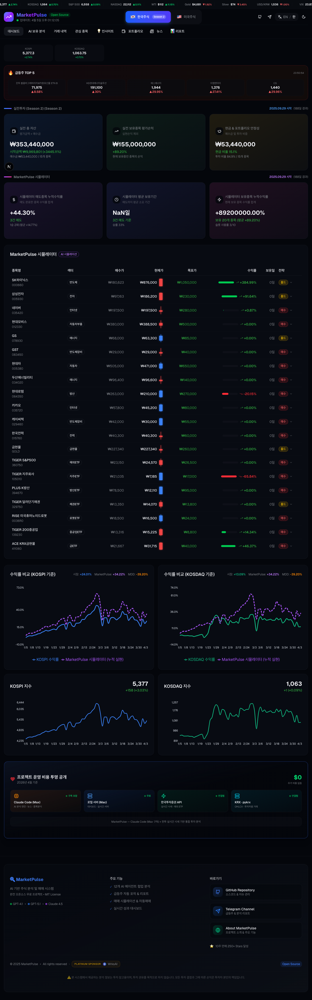
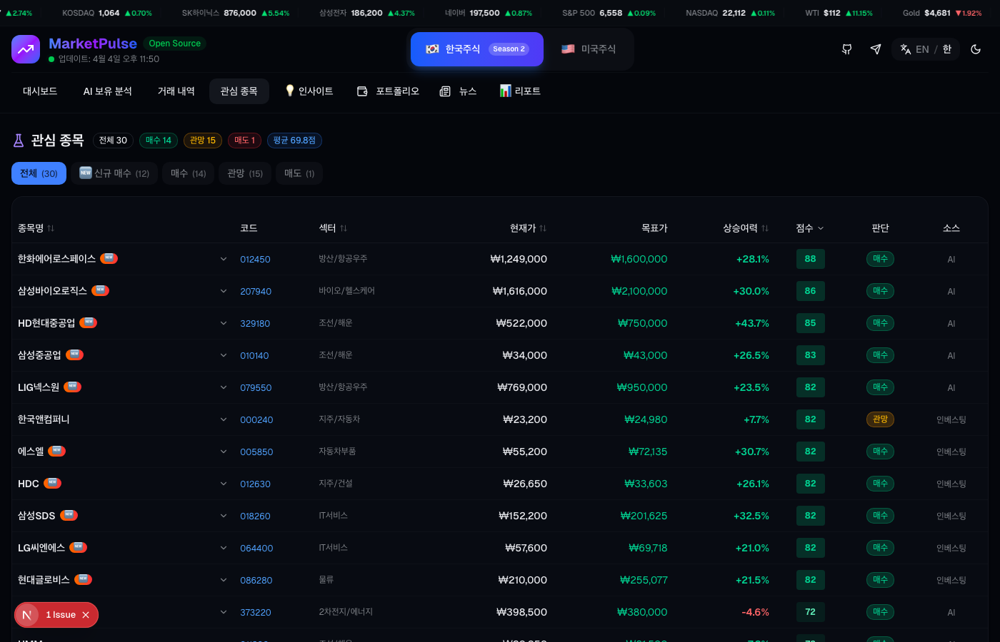
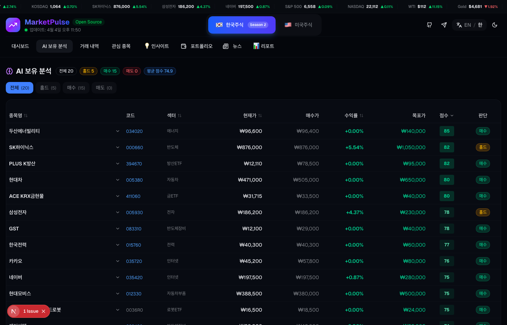
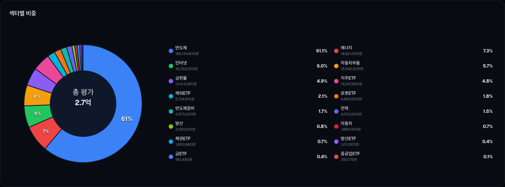

<div align="center">

# MarketPulse

[](https://opensource.org/licenses/MIT)
[](https://www.python.org/downloads/)
[](https://nextjs.org/)
[](https://www.anthropic.com/)
[](https://github.com/jacob119/market-pulse/stargazers)

**AI 기반 주식 분석 및 투자 대시보드 — Claude Code + 한투 API**

</div>

---

## 스크린샷

<p align="center">
  
</p>

<details>
<summary>더 보기</summary>
<br>
<p align="center">
  
  <br><br>
  
  <br><br>
  
</p>
</details>

---

## 주요 기능

- 🧠 **Investment Alpha 6인 에이전트 팀** — 거시경제, 원자재, 주식, 부동산, 종합분석, 월별 리포트
- 📊 **실시간 대시보드 (8개 탭)** — 포트폴리오, 관심종목, AI 판단, 매매이력, 인사이트, 뉴스, 리포트, 연구실
- 📈 **KIS API 실시간 시세** — 한국투자증권 API 연동 자동매매
- 📰 **뉴스 워드클라우드** — RSS + YouTube 기반 시장 뉴스 분석
- 🔬 **퀀트 스크리닝 + 신규 매수 추천** — AI 기반 종목 발굴
- 💼 **포트폴리오 관리** — 보유종목, 섹터 비중, 수익률 추적
- 🔗 **네이버 금융 연동** — 국내 시장 데이터 활용
- ✅ **E2E 테스트 26개** — Playwright 기반 대시보드 자동 테스트

---

## Quick Start

```bash
git clone https://github.com/jacob119/market-pulse.git
cd market-pulse

# Python 환경
python3 -m venv .venv && source .venv/bin/activate
pip install -r requirements.txt

# 대시보드
cd examples/dashboard && npm install && npm run dev
# http://localhost:3000
```

---

## 기술 스택

| 영역 | 기술 |
|------|------|
| AI / LLM | Claude Code (Anthropic), MCP Agent |
| 백엔드 | Python 3.11+, aiohttp, aiosqlite |
| 프론트엔드 | Next.js 16, React 19, TypeScript, Tailwind CSS |
| 주식 데이터 | 한국투자증권 KIS API, pykrx, Yahoo Finance |
| 데이터베이스 | SQLite (매매 시뮬레이션), PostgreSQL (투자 플랫폼) |
| PDF 변환 | Playwright (Chromium), pandoc |
| 메시징 | Telegram Bot API |
| 테스트 | Playwright E2E |
| 인프라 | Docker, Docker Compose |

---

## 프로젝트 구조

```
market-pulse/
├── cores/                  # 핵심 분석 엔진 (에이전트, LLM 클라이언트)
│   ├── agents/             # AI 에이전트 정의
│   └── chatgpt_proxy/     # ChatGPT OAuth 프록시
├── pipeline/               # 분석 파이프라인
├── trading/                # 매매 시뮬레이션 및 자동매매
├── tracking/               # 종목 추적
├── examples/
│   └── dashboard/          # Next.js 대시보드
│       ├── app/            # App Router 페이지
│       ├── components/     # React 컴포넌트 (20개)
│       └── e2e/            # Playwright E2E 테스트
├── prism-us/               # 미국 주식 분석 모듈
├── reports/                # 생성된 리포트
├── pdf_reports/            # PDF 변환 결과
├── docs/                   # 프로젝트 문서
├── scripts/                # 유틸리티 스크립트
├── docker/                 # Docker 설정
└── tests/                  # 테스트
```

---

## 문서

| 문서 | 설명 |
|------|------|
| [아키텍처](docs/ARCHITECTURE.md) | 시스템 아키텍처 및 데이터 흐름 |
| [기능 명세](docs/FEATURES.md) | 전체 기능 상세 설명 |
| [사용자 가이드](docs/USER_GUIDE.md) | 설치부터 사용까지 안내 |
| [AI 에이전트](docs/CLAUDE_AGENTS.md) | AI 에이전트 시스템 상세 |
| [매매 저널](docs/TRADING_JOURNAL.md) | 트레이딩 메모리 시스템 |
| [변경 이력](CHANGELOG.md) | 버전별 변경 사항 |

---

## 라이선스

[MIT License](LICENSE)

---

## 참고

- 원본: PRISM-INSIGHT (dragon1086) — fork 후 MarketPulse로 확장 개발
