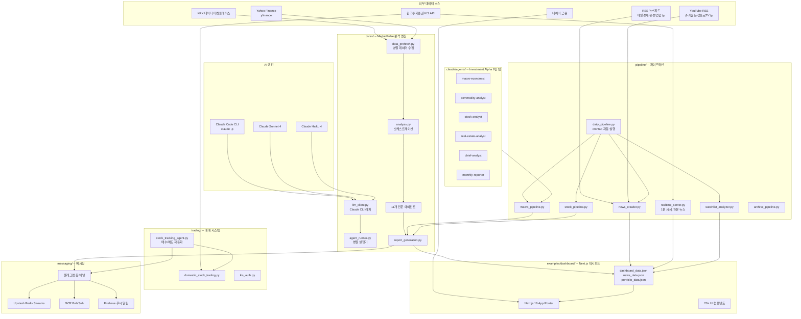
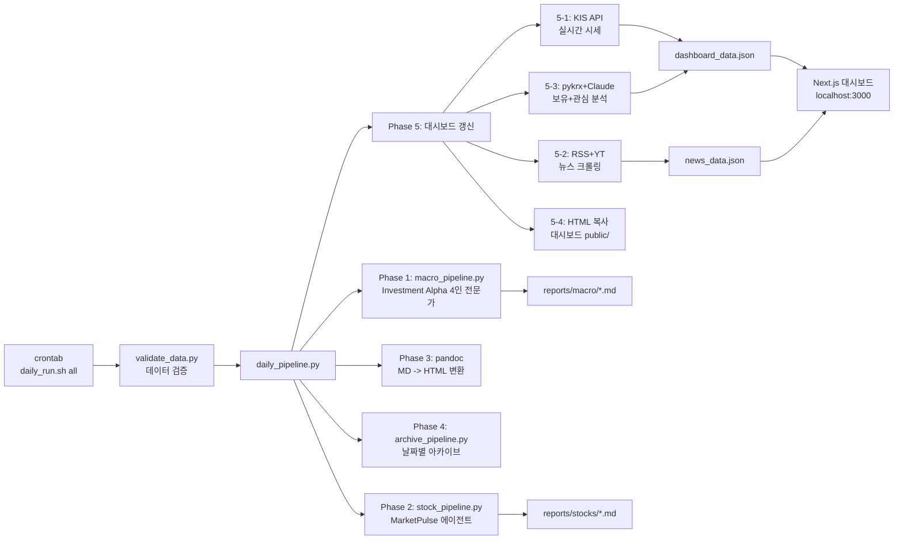
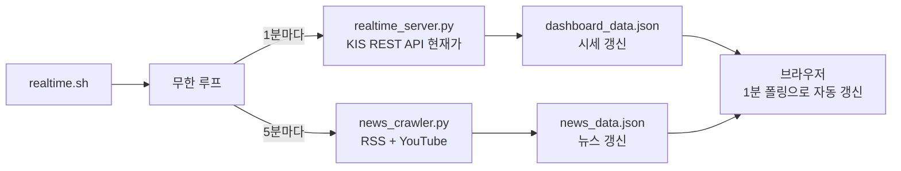
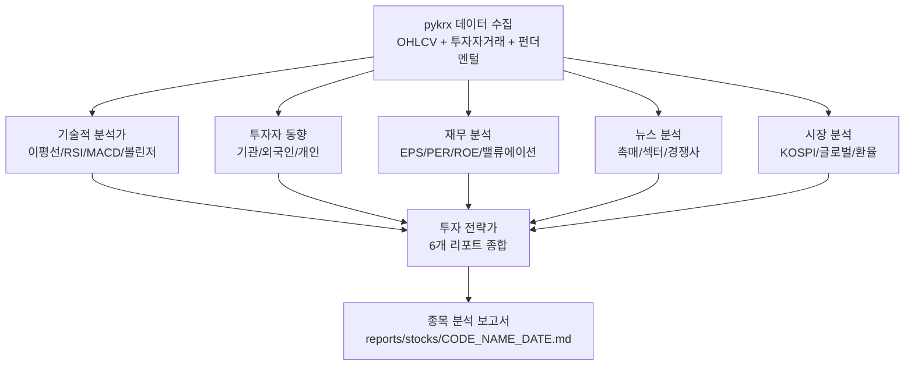
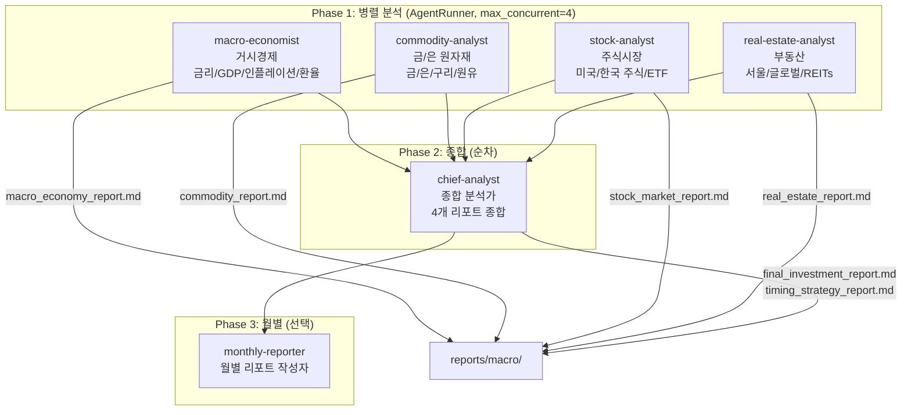
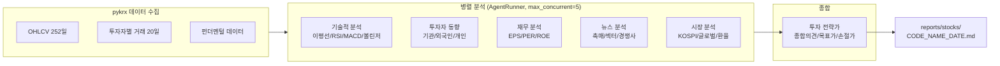
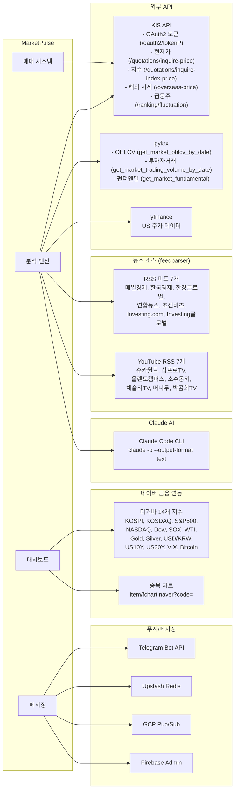

# MarketPulse 아키텍처 문서

> **MarketPulse (MarketPulse)**: AI 기반 한국/미국 주식 분석 + 자동 매매 + 실시간 투자 대시보드

---

## 1. 시스템 전체 아키텍처



---

## 2. 핵심 모듈별 역할

### 2.1 `cores/` -- AI 분석 엔진

MarketPulse 분석의 핵심 모듈로, AI 에이전트가 종목을 분석합니다.

| 파일 | 역할 |
|------|------|
| `llm_client.py` | Claude Code CLI (`claude -p`) subprocess 래퍼. Max 구독 크레딧 활용. 기본 모델: `claude-sonnet-4-20250514` |
| `agent_runner.py` | `AgentTask`/`AgentResult` 데이터클래스 + `AgentRunner` 병렬 실행기. `asyncio.Semaphore`로 동시성 제어 |
| `analysis.py` | 핵심 분석 오케스트레이션 (에이전트 순차 실행) |
| `data_prefetch.py` | 데이터 병렬 수집 (pykrx, KIS API) |
| `report_generation.py` | 리포트 템플릿 및 생성 |
| `stock_chart.py` | 차트 생성 (matplotlib/mplfinance) |
| `company_name_translator.py` | 종목명 한/영 번역 |
| `language_config.py` | 다국어 설정 |
| `main.py` | 메인 진입점 |

#### `cores/agents/` -- MarketPulse 에이전트 (11개)

| 파일 | 역할 |
|------|------|
| `stock_price_agents.py` | 기술분석 + 수급분석 (가격/거래량 패턴, 외국인/기관 수급) |
| `company_info_agents.py` | 재무분석 + 산업분석 (재무제표, 산업 동향) |
| `news_strategy_agents.py` | 뉴스분석 + 투자전략 (뉴스 감정분석, 종합 전략) |
| `market_index_agents.py` | 시장분석 (KOSPI/KOSDAQ 지수) |
| `macro_intelligence_agent.py` | 거시경제 인텔리전스 (레짐 감지, 섹터 로테이션) |
| `trading_agents.py` | 매수/매도 전문가 (AI 기반 매매 의사결정) |
| `trading_journal_agent.py` | 매매일지 (매매 기록 및 회고 분석) |
| `telegram_summary_optimizer_agent.py` | 텔레그램 요약 생성 |
| `telegram_summary_evaluator_agent.py` | 요약 품질평가 |
| `telegram_translator_agent.py` | 다국어 번역 (EN/JA/ZH/ES) |
| `memory_compressor_agent.py` | 과거 매매 기록 메모리 압축 |

#### `cores/chatgpt_proxy/` -- ChatGPT OAuth 프록시

| 파일 | 역할 |
|------|------|
| `oauth_login.py` | OAuth 로그인 |
| `proxy_server.py` | 프록시 서버 |
| `api_translator.py` | API 변환기 |
| `token_manager.py` | 토큰 관리 |
| `constants.py` | 상수 정의 |

---

### 2.2 `pipeline/` -- 파이프라인

데이터 수집부터 리포트 생성까지의 자동화 파이프라인입니다.

| 파일 | 역할 | 실행 주기 |
|------|------|----------|
| `daily_pipeline.py` | 통합 일일 파이프라인 (Phase 1~5: 매크로 -> 종목 -> HTML -> 아카이브 -> 대시보드) | crontab |
| `macro_pipeline.py` | Investment Alpha 4인 전문가 병렬 + 종합 분석가 순차 | daily_pipeline에서 호출 |
| `stock_pipeline.py` | MarketPulse 6인 에이전트 병렬 분석 (기술적/투자자/재무/뉴스/시장 + 전략가) | daily_pipeline에서 호출 |
| `news_crawler.py` | RSS 7개 + YouTube 7개 크롤링 + Claude AI 키워드/감정 분석 | 5분마다 (realtime.sh) |
| `news_analyzer.py` | Claude API 직접 호출 뉴스 키워드 분석 (대체 방식) | 필요 시 |
| `realtime_server.py` | KIS REST API 실시간 시세 조회 -> JSON 갱신 | 1분마다 (realtime.sh) |
| `watchlist_analyzer.py` | 보유 20종목 + 관심 30종목 통합 AI 분석 (pykrx + Claude) | daily_pipeline에서 호출 |
| `archive_pipeline.py` | 날짜별 아카이브 + pandoc HTML 변환 + 인덱스 페이지 | 파이프라인 종료 시 |

---

### 2.3 `examples/dashboard/` -- Next.js 대시보드

Next.js 16 기반 실시간 투자 대시보드입니다.

- **프레임워크**: Next.js 16, React 19, TypeScript
- **UI**: Tailwind CSS 4, Radix UI, Recharts, Lucide Icons
- **테스트**: Playwright E2E
- **데이터**: `public/` 디렉토리의 정적 JSON 파일을 1분마다 폴링
- **다국어**: 한국어/영어 지원 (`language-provider.tsx`)
- **시장 선택**: KR/US 시장 토글 (`market-selector.tsx`)

---

### 2.4 `scripts/` -- 실행 스크립트

| 파일 | 역할 |
|------|------|
| `daily_run.sh` | 일일 파이프라인 실행 (데이터 검증 -> macro/stocks/all 모드) |
| `realtime.sh` | 실시간 서버 (시세 1분 + 뉴스 5분 주기 무한 루프) |
| `news_update.sh` | 뉴스 크롤링 단독 실행 |
| `generate_dashboard_data.py` | 대시보드 JSON 초기 생성 |
| `validate_data.py` | 데이터 품질 검증 (티커 형식, 필수값, 중복, 티커-종목명 매핑) |

---

## 3. 데이터 흐름도

### 3.1 일일 파이프라인 (crontab)



### 3.2 실시간 서버 (장중)



### 3.3 종목 분석 흐름 (stock_pipeline.py)



---

## 4. 기술 스택

### 백엔드 (Python 3.11+)

| 카테고리 | 기술 |
|---------|------|
| AI/LLM | Claude Code CLI (`claude -p`), Claude Sonnet 4, Claude Haiku 4 |
| 주가 데이터 | pykrx 1.0.48, yfinance (US), kospi_kosdaq_stock_server |
| 증권 API | 한국투자증권 KIS REST API + WebSocket |
| 뉴스 수집 | feedparser (RSS 7개 + YouTube 7개) |
| 비동기 처리 | asyncio, aiohttp, aiosqlite |
| 데이터 분석 | pandas 2.2, numpy, scipy |
| 차트 생성 | matplotlib, seaborn, mplfinance |
| PDF 생성 | pandoc (MD -> HTML) + Chrome headless (HTML -> PDF) |
| DB | SQLite (aiosqlite) |
| 메시징 | python-telegram-bot, Upstash Redis, GCP Pub/Sub |
| 모바일 연동 | Firebase Admin SDK |
| 스케줄링 | APScheduler, crontab |
| JSON 처리 | ujson, json-repair |

### 프론트엔드 (Node.js)

| 카테고리 | 기술 | 버전 |
|---------|------|------|
| 프레임워크 | Next.js | 16.1.6 |
| UI 렌더링 | React | 19.2.0 |
| 타입 | TypeScript | 5.x |
| 스타일링 | Tailwind CSS | 4.1.9 |
| UI 컴포넌트 | Radix UI (20+ 컴포넌트), Lucide Icons | 최신 |
| 차트 | Recharts | 최신 |
| E2E 테스트 | Playwright | 1.59.1 |
| 동시 실행 | concurrently (dev + realtime) | 9.2.1 |

### 인프라

| 카테고리 | 기술 |
|---------|------|
| 컨테이너 | Docker, Docker Compose |
| 스케줄링 | crontab (평일 자동 실행), pmset (macOS 자동 기상) |
| 모니터링 | 텔레그램 알림, 로그 파일 (`logs/pipeline_YYYY-MM-DD.log`) |

---

## 5. 디렉토리 구조

```
prism-alpha/
├── cores/                              # AI 분석 엔진
│   ├── __init__.py
│   ├── llm_client.py                   # Claude CLI 래퍼 (claude -p subprocess)
│   ├── agent_runner.py                 # AgentTask/AgentResult + AgentRunner
│   ├── analysis.py                     # 핵심 분석 오케스트레이션
│   ├── data_prefetch.py                # pykrx 데이터 사전 조회
│   ├── report_generation.py            # 리포트 생성
│   ├── stock_chart.py                  # 차트 생성
│   ├── company_name_translator.py      # 종목명 번역
│   ├── language_config.py              # 다국어 설정
│   ├── main.py                         # 메인 진입점
│   ├── utils.py                        # 공통 유틸리티
│   ├── chatgpt_proxy/                  # ChatGPT OAuth 프록시
│   │   ├── oauth_login.py
│   │   ├── proxy_server.py
│   │   ├── api_translator.py
│   │   ├── token_manager.py
│   │   └── constants.py
│   └── agents/                         # MarketPulse 에이전트 (11개)
│       ├── stock_price_agents.py       #   기술분석 + 수급분석
│       ├── company_info_agents.py      #   재무분석 + 산업분석
│       ├── news_strategy_agents.py     #   뉴스분석 + 투자전략
│       ├── market_index_agents.py      #   시장분석 (KOSPI/KOSDAQ)
│       ├── macro_intelligence_agent.py #   거시경제 인텔리전스
│       ├── trading_agents.py           #   매수/매도 전문가
│       ├── trading_journal_agent.py    #   매매일지
│       ├── telegram_summary_optimizer_agent.py  # 텔레그램 요약
│       ├── telegram_summary_evaluator_agent.py  # 요약 품질평가
│       ├── telegram_translator_agent.py         # 다국어 번역
│       └── memory_compressor_agent.py  #   메모리 압축
│
├── pipeline/                           # 데이터 파이프라인
│   ├── __init__.py
│   ├── daily_pipeline.py               # 통합 일일 파이프라인 (Phase 1~5)
│   ├── macro_pipeline.py               # 매크로 분석 (Investment Alpha)
│   ├── stock_pipeline.py               # 종목 분석 (MarketPulse 6인 에이전트)
│   ├── realtime_server.py              # KIS API 실시간 시세 서버
│   ├── news_crawler.py                 # RSS + YouTube 크롤링 + AI 분석
│   ├── news_analyzer.py                # 뉴스 심층 분석
│   ├── watchlist_analyzer.py           # 보유+관심종목 통합 분석
│   └── archive_pipeline.py             # 날짜별 아카이브 + HTML 변환
│
├── scripts/                            # 실행 스크립트
│   ├── daily_run.sh                    # 일일 파이프라인 (crontab용)
│   ├── realtime.sh                     # 실시간 서버 (시세 1분 + 뉴스 5분)
│   ├── news_update.sh                  # 뉴스 크롤링 단독
│   ├── generate_dashboard_data.py      # JSON 초기 생성
│   └── validate_data.py               # 데이터 품질 검증
│
├── examples/
│   ├── dashboard/                      # Next.js 대시보드
│   │   ├── app/
│   │   │   ├── page.tsx                # 메인 페이지 (8탭 라우팅)
│   │   │   ├── layout.tsx              # 루트 레이아웃
│   │   │   └── landing/               # 랜딩 페이지
│   │   ├── components/
│   │   │   ├── dashboard-header.tsx    # 헤더 + 탭 네비게이션
│   │   │   ├── market-ticker-bar.tsx   # 14개 지수 티커바 (네이버 연동)
│   │   │   ├── holdings-table.tsx      # 보유종목 테이블 + 미니캔들
│   │   │   ├── metrics-cards.tsx       # 핵심 지표 카드
│   │   │   ├── performance-chart.tsx   # 시장 차트 (Recharts)
│   │   │   ├── ai-decisions-page.tsx   # AI 보유 분석 (필터/정렬/아코디언)
│   │   │   ├── trading-history-page.tsx# 거래 내역
│   │   │   ├── watchlist-page.tsx      # 관심종목 (퀀트 스크리닝)
│   │   │   ├── trading-insights-page.tsx# 인사이트 (트레이딩 원칙/저널/직관)
│   │   │   ├── portfolio-page.tsx      # 포트폴리오 (파이차트/CRUD)
│   │   │   ├── news-page.tsx           # 뉴스 (워드클라우드/감정분석)
│   │   │   ├── reports-page.tsx        # 리포트 뷰어 (iframe)
│   │   │   ├── stock-detail-modal.tsx  # 종목 상세 모달
│   │   │   ├── mini-candle.tsx         # 미니 캔들 차트 (SVG)
│   │   │   ├── market-selector.tsx     # KR/US 시장 선택
│   │   │   ├── language-provider.tsx   # 한/영 다국어 Provider
│   │   │   ├── theme-provider.tsx      # 다크/라이트 테마
│   │   │   ├── operating-costs-card.tsx# 운영 비용 카드
│   │   │   ├── trigger-reliability-badge.tsx
│   │   │   ├── trigger-reliability-card.tsx
│   │   │   ├── project-footer.tsx
│   │   │   └── ui/                     # shadcn/ui 컴포넌트 (56개)
│   │   ├── lib/
│   │   │   ├── naver-chart.ts          # 네이버 차트 URL 생성
│   │   │   └── currency.ts             # 통화 포맷 (KRW/USD)
│   │   ├── types/
│   │   │   └── dashboard.ts            # TypeScript 타입 정의
│   │   ├── public/
│   │   │   ├── dashboard_data.json     # 메인 대시보드 데이터
│   │   │   ├── dashboard_data_en.json  # 영문 대시보드 데이터
│   │   │   ├── news_data.json          # 뉴스 데이터
│   │   │   ├── portfolio_data.json     # 포트폴리오 데이터
│   │   │   ├── reports/                # HTML 리포트
│   │   │   └── screenshots/            # 스크린샷
│   │   ├── e2e/
│   │   │   ├── dashboard.spec.ts       # Playwright E2E 테스트
│   │   │   └── screenshots/            # 테스트 스크린샷
│   │   ├── package.json
│   │   └── playwright.config.ts
│   ├── generate_dashboard_json.py      # 대시보드 데이터 생성 (KR)
│   └── generate_us_dashboard_json.py   # 대시보드 데이터 생성 (US)
│
├── .claude/agents/                     # Investment Alpha 에이전트 (6인)
│   ├── macro-economist.md              # 거시경제 전문가
│   ├── commodity-analyst.md            # 원자재 분석가
│   ├── stock-analyst.md                # 주식 전문가
│   ├── real-estate-analyst.md          # 부동산 전문가
│   ├── chief-analyst.md                # 종합 분석가
│   └── monthly-reporter.md             # 월별 리포트 작성자
│
├── trading/                            # KIS API 매매
│   ├── config/kis_devlp.yaml           # KIS API 인증 설정
│   ├── domestic_stock_trading.py
│   ├── kis_auth.py
│   └── portfolio_telegram_reporter.py
│
├── prism-us/                           # 미국 주식 모듈
├── tracking/                           # 종목 추적
├── messaging/                          # 메시징 (Redis, GCP Pub/Sub)
├── events/                             # 이벤트 처리
├── tests/                              # 테스트
├── utils/                              # 유틸리티
├── reports/                            # 리포트 출력
│   ├── macro/                          # 매크로 리포트 (MD + HTML)
│   ├── stocks/                         # 종목별 분석 리포트
│   └── archive/                        # 날짜별 아카이브
├── docs/                               # 프로젝트 문서
├── docker/                             # Docker 설정
├── sqlite/                             # SQLite 연동
│
├── stock_analysis_orchestrator.py      # KR 분석 오케스트레이터
├── trigger_batch.py                    # 급등/모멘텀 감지
├── stock_tracking_agent.py             # 종목 추적 에이전트
├── telegram_ai_bot.py                  # 텔레그램 AI 봇
├── report_generator.py                 # 리포트 생성기
├── pdf_converter.py                    # PDF 변환 (pandoc + Chrome)
├── firebase_bridge.py                  # Firebase 푸시 알림
│
├── requirements.txt                    # Python 의존성
├── mcp_agent.config.yaml               # MCP 에이전트 설정
├── Dockerfile                          # Docker 이미지
└── docker-compose.yml                  # Docker Compose
```

---

## 6. 에이전트 아키텍처

MarketPulse는 두 개의 독립적인 에이전트 시스템을 운영합니다.

### 6.1 Investment Alpha 팀 (6인 에이전트)

Claude Code CLI 기반으로 실행되는 투자 분석 팀입니다.



- **에이전트 정의**: `.claude/agents/*.md`
- **실행 방식**: `macro_pipeline.py` -> `AgentRunner` -> `LLMClient` -> `claude -p`
- **산출물**: `reports/macro/` 디렉토리에 MD + HTML 리포트

### 6.2 MarketPulse 종목 분석 에이전트

`stock_pipeline.py`에서 5개 에이전트 병렬 분석 + 전략가 종합을 실행합니다.



- **에이전트 프롬프트**: `stock_pipeline.py` 내장 (각 3000자 이내 응답)
- **실행 방식**: `AgentRunner` -> `LLMClient` -> `claude -p`
- **산출물**: `reports/stocks/` 디렉토리에 종목별 분석 리포트

---

## 7. API / 외부 서비스 연동 구조



### 설정 파일

| 파일 | 용도 |
|------|------|
| `.env` | 텔레그램 토큰, 채널 ID, Redis/GCP/Firebase 설정 |
| `mcp_agent.config.yaml` | MCP 서버 설정 |
| `mcp_agent.secrets.yaml` | API 키 (비공개) |
| `trading/config/kis_devlp.yaml` | KIS 매매 API 인증 (app_key, app_secret, URL) |

### KIS API 토큰 관리

- 토큰 캐싱: `.kis_token.json` (24시간 유효)
- 자동 갱신: `time.time() < token_expires` 검사 후 필요 시 재발급
- Rate Limit: API 호출 사이 200~300ms sleep

### 네이버 금융 연동 (14개 지수)

`market-ticker-bar.tsx`에서 대시보드 JSON의 실시간 데이터를 읽어 표시하며, 각 지수 클릭 시 네이버 금융 해당 페이지로 이동합니다.

| 지수 | 네이버 URL |
|------|-----------|
| KOSPI | `finance.naver.com/sise/` |
| KOSDAQ | `finance.naver.com/sise/sise_index.naver?code=KOSDAQ` |
| S&P 500 | `finance.naver.com/world/sise.naver?symbol=SPI@SPX` |
| NASDAQ | `finance.naver.com/world/sise.naver?symbol=NAS@IXIC` |
| Dow Jones | `finance.naver.com/world/sise.naver?symbol=DJI@DJI` |
| SOX | `finance.naver.com/world/sise.naver?symbol=NAS@SOX` |
| WTI | `finance.naver.com/marketindex/worldDailyQuote.naver?marketindexCd=OIL_CL` |
| Gold | `finance.naver.com/marketindex/goldDailyQuote.naver` |
| Silver | `finance.naver.com/marketindex/worldDailyQuote.naver?marketindexCd=CMDT_SI` |
| USD/KRW | `finance.naver.com/marketindex/exchangeDailyQuote.naver?marketindexCd=FX_USDKRW` |
| US10Y | `finance.naver.com/marketindex/interestDetail.naver?marketindexCd=IRR_US10Y` |
| US30Y | `finance.naver.com/marketindex/interestDetail.naver?marketindexCd=IRR_US30Y` |
| VIX | `finance.naver.com/world/sise.naver?symbol=CBOE@VIX` |
| Bitcoin | `upbit.com/exchange?code=CRIX.UPBIT.KRW-BTC` |

### 네이버 종목 차트 연동

`lib/naver-chart.ts`에서 종목 코드를 네이버 금융 차트 URL로 변환:
- 6자리 숫자 코드: `https://finance.naver.com/item/fchart.naver?code={ticker}`
- 영문+숫자 혼합 ETF (예: `0036R0`): 동일 URL 패턴
- 특수 티커 (GOLD 등): 링크 없음 (null 반환)
